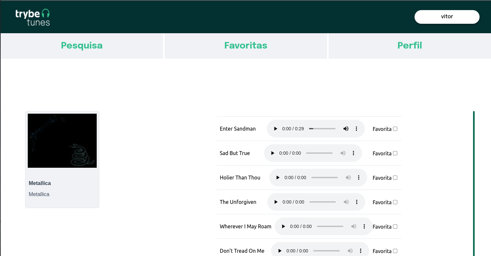

# Trybetunes

This project was developed during the web development course at [Trybe](https://www.betrybe.com/). <br>
The project is a front end music application that uses [ITunes API](https://developer.apple.com/library/archive/documentation/AudioVideo/Conceptual/iTuneSearchAPI/index.html#//apple_ref/doc/uid/TP40017632-CH3-SW1) and allow the user to listen the free 20 seconds version of Itunes songs



## Installation

Clone this repository
```bash
git clone git@github.com:VitorCorrea18/project-trybetunes.git
```
In the project's folder install the dependencies
```bash
npm install
```
Start the project
```bash
npm start
```

<b>Now it should be running on your default browser</b>

## Usage

* <b>Login</b><br>
>You must enter you name and click on 'Entrar' button

* <b>Navigation menu</b> <br>
>Bellow the header you will see a navigation menu with 3 buttons:
>- Pesquisar: Takes oyou to the search page, the first one to open once you passed the login
>- Favoritas: Takes you to the Favorites page where you can see your favorite songs
>- Perfil: Takes you to the profile page

* <b>Search page</b> <br>
>Here you can search for an artist using the search bar then click on 'Procurar' button. It will list all the albuns found for the searched artist, <br>
>once you click on an album card you will be taken to that album's page.

* <b>Album Page</b> <br>
>Here you can see and listen to all the songs of that album. The checkbox 'Favorita' will mark the song as a favorite, and will be listed at the favorites page.

* <b>Favorites</b> <br>
 >This is where all the songs you marked as favorite will be listed and you can listen them here as well.
 
* <b>Profile</b> <br>
>Here you can see and edit your profile info, like avatar, email and bio.

## Obervation
  The project could not be completed 100% in the time given, as there were much more to study and projects to be carried out,
  so the profile editing were not finished. Maybe with time i can come back to review this and implement this.
  
 <b>Feedbacks are welcome 🚀</b>
